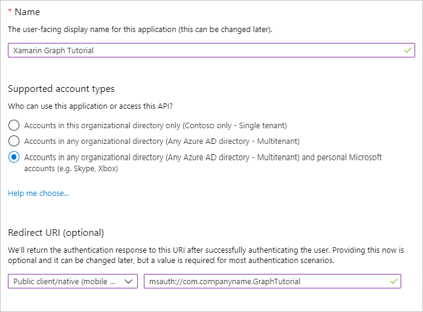
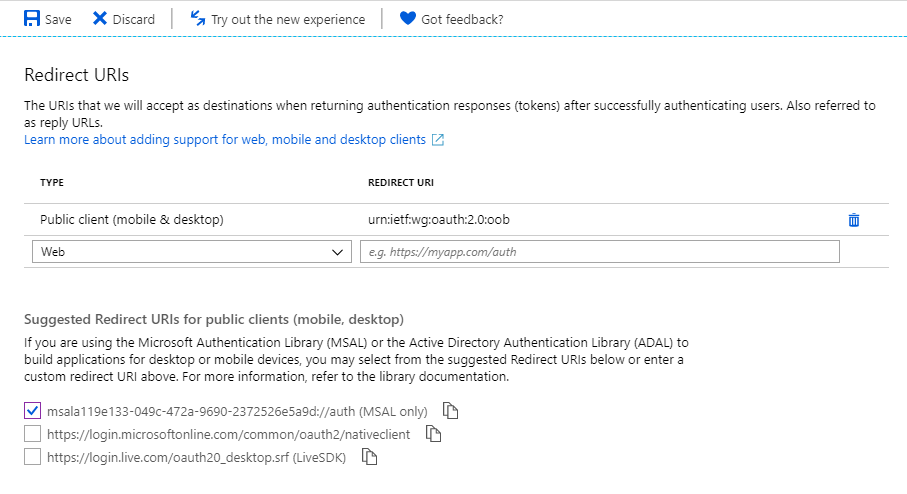

# Выполнение завершенного проекта

## Необходимые компоненты

Чтобы запустить завершенный проект в этой папке, вам потребуются следующие компоненты:

- [Visual Studio](https://visualstudio.microsoft.com/vs/) , установленный на компьютере для разработки. (**Примечание:** это руководство написано в visual Studio 2017 версии 15.9.6 и Visual Studio для Mac версии 7.7.4. Действия, описанные в этом руководстве, могут работать с другими версиями, но не тестировались.
- Xamarin устанавливается в составе установки Visual Studio. Инструкции по установке и настройке Xamarin приведены в разделе [Установка Xamarin](https://docs.microsoft.com/xamarin/cross-platform/get-started/installation) .
- Личная учетная запись Майкрософт с почтовым ящиком на Outlook.com или рабочей или учебной учетной записью Майкрософт.

Если у вас нет учетной записи Майкрософт, у вас есть несколько вариантов для получения бесплатной учетной записи:

- Вы можете [зарегистрироваться для создания новой личной учетной записи Майкрософт](https://signup.live.com/signup?wa=wsignin1.0&rpsnv=12&ct=1454618383&rver=6.4.6456.0&wp=MBI_SSL_SHARED&wreply=https://mail.live.com/default.aspx&id=64855&cbcxt=mai&bk=1454618383&uiflavor=web&uaid=b213a65b4fdc484382b6622b3ecaa547&mkt=E-US&lc=1033&lic=1).
- Вы можете [зарегистрироваться в программе для разработчиков office 365](https://developer.microsoft.com/office/dev-program) , чтобы получить бесплатную подписку на Office 365.

## Регистрация приложения на портале Azure

1. Откройте браузер и перейдите к [Центру администрирования Azure Active Directory](https://aad.portal.azure.com). Войдите с помощью **личной учетной записи** (т.е. учетной записи Microsoft) или **рабочей (учебной) учетной записи**.

1. Выберите **Новая регистрация**. На странице**Зарегистрировать приложение** задайте необходимые значения следующим образом.

    - Введите **имя** `Xamarin Graph Tutorial`.
    - Введите **поддерживаемые типы учетных записей** для **учетных записей в любом каталоге организаций и личных учетных записей Microsoft**.
    - Оставьте поле **URI перенаправления** пустым.

    

1. Нажмите кнопку **Зарегистрировать**. На странице **учебника Xamarin Graph** СКОПИРУЙТЕ значение **идентификатора Application (Client)** и сохраните его, он понадобится на следующем шаге.

    

1. Выберите ссылку **Добавить URI перенаправления** . На странице " **Перенаправление URI** " выберите раздел **Перенаправление URI для общедоступных клиентов (мобильный, Настольный)** . Выберите URI, который начинается с `msal` **и** **urn: IETF: ВГ: OAuth: 2.0: URI OOB** . Скопируйте значение, начинающееся с `msal`, а затем нажмите кнопку **сохранить**. Сохраните скопированный URI перенаправления, он понадобится вам на следующем шаге.

    

## Настройка примера

1. Переименуйте `./GraphTutorial/GraphTutorial/Models/OAuthSettings.cs.example` файл в `OAuthSettings.cs`.
1. Измените `OAuthSettings.cs` файл и внесите следующие изменения.
    1. Замените `YOUR_APP_ID_HERE` идентификатором **приложения** , полученным с портала Azure.
    1. Замените `YOUR_REDIRECT_URI_HERE` на URI перенаправления, начинающийся `msal` с портала Azure.
1. В проекте **графтуториал. iOS** откройте `Info.plist` файл.
    1. На вкладке **Дополнительно** перейдите в раздел **типы URL-адресов** . Измените запись **схемы URL-адресов** из `YOUR_REDIRECT_URI_HERE` записи в URI перенаправления из регистрации приложения, начинающейся с `msal`.

## Запуск приложения

В Visual Studio нажмите клавишу **F5** или выберите **Отладка _гт_ начать отладку**.