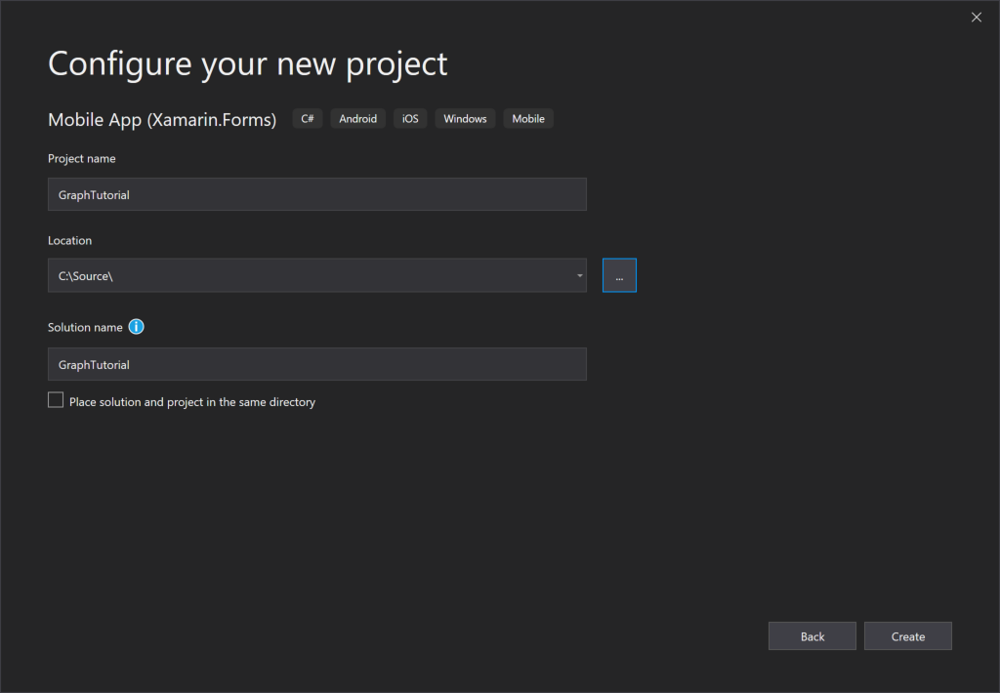
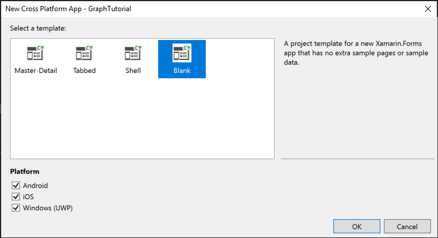

<!-- markdownlint-disable MD002 MD041 -->

Откройте Visual Studio и выберите **создать новый проект**. В диалоговом окне **Создание нового проекта** выберите **мобильные приложения (Xamarin. Forms)**, а затем нажмите кнопку **Далее**.


В диалоговом окне **Настройка нового проекта** введите `GraphTutorial` **имя проекта** и **имя решения**, а затем нажмите кнопку **создать**.

> [!IMPORTANT]
> Убедитесь, что вы вводите точно такое же имя для проекта Visual Studio, которое указано в этих инструкциях лаборатории. Имя проекта Visual Studio становится частью пространства имен в коде. Код в этих инструкциях зависит от пространства имен, которое соответствует имени проекта Visual Studio, указанного в данных инструкциях. Если вы используете другое имя проекта, код не будет компилироваться, если не настроить все пространства имен в качестве имени проекта Visual Studio, вводимого при создании проекта.



В диалоговом окне **Создание многоплатформенного приложения** выберите **пустой** шаблон и выберите платформы, которые необходимо создать на **платформе**. Нажмите кнопку **ОК** , чтобы создать решение.



Прежде чем переходить, установите некоторые дополнительные пакеты NuGet, которые будут использоваться позже.

- [Microsoft. Identity. Client](https://www.nuget.org/packages/Microsoft.Identity.Client/) для обработки проверки подлинности и управления маркерами Azure AD.
- [Microsoft. Graph](https://www.nuget.org/packages/Microsoft.Graph/) для совершения вызовов в Microsoft Graph.

Выберите **инструменты > диспетчер пакетов NuGet > консоли диспетчера пакетов**. В консоли диспетчера пакетов введите указанные ниже команды.

```Powershell
Install-Package Microsoft.Identity.Client -Version 3.0.8 -Project GraphTutorial
Install-Package Microsoft.Identity.Client -Version 3.0.8 -Project GraphTutorial.Android
Install-Package Microsoft.Identity.Client -Version 3.0.8 -Project GraphTutorial.iOS
Install-Package Microsoft.Graph -Version 1.15.0 -Project GraphTutorial
```

## <a name="design-the-app"></a>Проектирование приложения

Сначала обновите `App` класс, чтобы добавить переменные для отслеживания состояния проверки подлинности и вошедшего пользователя. В **обозревателе решений**разверните проект **графтуториал** , а затем разверните файл **app. XAML** . Откройте файл **app.XAML.CS** и добавьте приведенные ниже `using` операторы в начало файла.

```cs
using System.ComponentModel;
using System.IO;
using System.Reflection;
using System.Threading.Tasks;
```

Затем добавьте `INotifyPropertyChanged` интерфейс к объявлению класса.

```cs
public partial class App : Application, INotifyPropertyChanged
```

Теперь добавьте в `App` класс указанные ниже свойства.

```cs
// Is a user signed in?
private bool isSignedIn;
public bool IsSignedIn
{
    get { return isSignedIn; }
    set
    {
        isSignedIn = value;
        OnPropertyChanged("IsSignedIn");
        OnPropertyChanged("IsSignedOut");
    }
}

public bool IsSignedOut { get { return !isSignedIn; } }

// The user's display name
private string userName;
public string UserName
{
    get { return userName; }
    set
    {
        userName = value;
        OnPropertyChanged("UserName");
    }
}

// The user's email address
private string userEmail;
public string UserEmail
{
    get { return userEmail; }
    set
    {
        userEmail = value;
        OnPropertyChanged("UserEmail");
    }
}

// The user's profile photo
private ImageSource userPhoto;
public ImageSource UserPhoto
{
    get { return userPhoto; }
    set
    {
        userPhoto = value;
        OnPropertyChanged("UserPhoto");
    }
}
```

Теперь добавьте в `App` класс следующие функции. Функции `SignIn`, `SignOut`и, `GetUserInfo` а также — это просто заполнители.

```cs
public async Task SignIn()
{
    await GetUserInfo();

    IsSignedIn = true;
}

public async Task SignOut()
{
    UserPhoto = null;
    UserName = string.Empty;
    UserEmail = string.Empty;
    IsSignedIn = false;
}

private async Task GetUserInfo()
{
    UserPhoto = ImageSource.FromStream(() => GetUserPhoto());
    UserName = "Adele Vance";
    UserEmail = "adelev@contoso.com";
}

private Stream GetUserPhoto()
{
    // Return the default photo
    return Assembly.GetExecutingAssembly().GetManifestResourceStream("GraphTutorial.no-profile-pic.png");
}
```

`GetUserPhoto` Функция возвращает фотографию, используемую по умолчанию. Вы можете указать собственный файл здесь или скачать его, использованный в примере, на сайте [GitHub](https://github.com/microsoftgraph/msgraph-training-xamarin/blob/master/tutorial/images/no-profile-pic.png). Скопируйте файл в `./GraphTutorial/GraphTutorial` каталог. Щелкните правой кнопкой мыши проект **графтуториал** в **обозревателе решений** и выберите **добавить**, а затем **существующий элемент...**. Выберите `no-profile-pic.png` файл и нажмите кнопку **Добавить**. Теперь щелкните правой кнопкой мыши файл в **обозревателе решений** и выберите пункт **свойства**. В окне **Свойства** измените значение **действия** при построении на внедренный **ресурс**.


### <a name="app-navigation"></a>Навигация в приложении

Затем замените основную страницу приложения на [страницу "основной-подробности](/xamarin/xamarin-forms/app-fundamentals/navigation/master-detail-page)". Откроется меню навигации, чтобы переключиться между представлениями в приложении.

Откройте файл **MainPage. XAML** в проекте **графтуториал** и замените его содержимое приведенным ниже кодом.

```xml
<?xml version="1.0" encoding="utf-8" ?>
<MasterDetailPage xmlns="http://xamarin.com/schemas/2014/forms"
             xmlns:x="http://schemas.microsoft.com/winfx/2009/xaml"
             xmlns:local="clr-namespace:GraphTutorial"
             x:Class="GraphTutorial.MainPage">

    <MasterDetailPage.Master>
        <local:MenuPage/>
    </MasterDetailPage.Master>

    <MasterDetailPage.Detail>
        <NavigationPage>
            <x:Arguments>
                <local:WelcomePage/>
            </x:Arguments>
        </NavigationPage>
    </MasterDetailPage.Detail>

</MasterDetailPage>
```

#### <a name="implement-the-menu"></a>Реализация меню

Начните с создания модели для представления элементов меню. Щелкните правой кнопкой мыши проект **графтуториал** и выберите команду **Добавить**, а затем — **Новая папка**. Назовите папку `Models`.

Щелкните правой кнопкой мыши **** папку Models и выберите команду **Добавить**, а затем — **класс...**. Назовите класс `NavMenuItem` и нажмите кнопку **Добавить**. Откройте файл **NavMenuItem.CS** и замените его содержимое на приведенный ниже код.

```cs
namespace GraphTutorial.Models
{
    public enum MenuItemType
    {
        Welcome,
        Calendar
    }

    public class NavMenuItem
    {
        public MenuItemType Id { get; set; }

        public string Title { get; set; }
    }
}
```

Теперь добавьте страницу меню. Щелкните правой кнопкой мыши проект **графтуториал** и выберите команду **Добавить**, а затем — **новый элемент...**. Выберите **страницу содержимого** и присвойте странице `MenuPage`имя. Нажмите кнопку **Добавить**. Откройте файл **менупаже. XAML** и замените его содержимое приведенным ниже кодом.

```xml
<?xml version="1.0" encoding="utf-8" ?>
<ContentPage xmlns="http://xamarin.com/schemas/2014/forms"
             xmlns:x="http://schemas.microsoft.com/winfx/2009/xaml"
             xmlns:ios="clr-namespace:Xamarin.Forms.PlatformConfiguration.iOSSpecific;assembly=Xamarin.Forms.Core"
             ios:Page.UseSafeArea="true"
             Title="Menu"
             x:Class="GraphTutorial.MenuPage">
    <ContentPage.Padding>
        <OnPlatform x:TypeArguments="Thickness">
            <On Platform="UWP" Value="10, 10, 10, 10" />
        </OnPlatform>
    </ContentPage.Padding>
    <ContentPage.Content>
        <StackLayout VerticalOptions="Start" HorizontalOptions="Center">
            <StackLayout x:Name="UserArea" />

            <!-- Signed out UI -->
            <StackLayout IsVisible="{Binding Path=IsSignedOut, Source={x:Static Application.Current}}">
                <Label Text="Sign in to get started"
                       HorizontalOptions="Center"
                       FontAttributes="Bold"
                       FontSize="Medium"
                       Margin="10,20,10,20" />
                <Button Text="Sign in"
                        Clicked="OnSignIn"
                        HorizontalOptions="Center" />
            </StackLayout>

            <!-- Signed in UI -->
            <StackLayout IsVisible="{Binding Path=IsSignedIn, Source={x:Static Application.Current}}">
                <Image Source="{Binding Path=UserPhoto, Source={x:Static Application.Current}}"
                       HorizontalOptions="Center"
                       Margin="0,20,0,10" />
                <Label Text="{Binding Path=UserName, Source={x:Static Application.Current}}"
                       HorizontalOptions="Center"
                       FontAttributes="Bold"
                       FontSize="Small" />
                <Label Text="{Binding Path=UserEmail, Source={x:Static Application.Current}}"
                       HorizontalOptions="Center"
                       FontAttributes="Italic" />
                <Button Text="Sign out"
                        Margin="0,20,0,20"
                        Clicked="OnSignOut"
                        HorizontalOptions="Center" />
                <ListView x:Name="ListViewMenu"
                          HasUnevenRows="True"
                          HorizontalOptions="Start">
                    <ListView.ItemTemplate>
                        <DataTemplate>
                            <ViewCell>
                                <Grid Padding="10">
                                    <Label Text="{Binding Title}" FontSize="20"/>
                                </Grid>
                            </ViewCell>
                        </DataTemplate>
                    </ListView.ItemTemplate>
                </ListView>
            </StackLayout>
        </StackLayout>
    </ContentPage.Content>
</ContentPage>
```

Теперь разверните **менупаже. XAML** в **обозревателе решений** и откройте файл **MenuPage.XAML.CS** . Замените его содержимое приведенным ниже.

```cs
using System;
using System.Collections.Generic;
using System.Linq;
using System.Text;
using System.Threading.Tasks;

using Xamarin.Forms;
using Xamarin.Forms.Xaml;

using GraphTutorial.Models;

namespace GraphTutorial
{
    [XamlCompilation(XamlCompilationOptions.Compile)]
    public partial class MenuPage : ContentPage
    {
        MainPage RootPage => Application.Current.MainPage as MainPage;
        List<NavMenuItem> menuItems;

        public MenuPage ()
        {
            InitializeComponent ();

            // Add items to the menu
            menuItems = new List<NavMenuItem>
            {
                new NavMenuItem {Id = MenuItemType.Welcome, Title="Home" },
                new NavMenuItem {Id = MenuItemType.Calendar, Title="Calendar" }
            };
            ListViewMenu.ItemsSource = menuItems;

            // Initialize the selected item
            ListViewMenu.SelectedItem = menuItems[0];

            // Handle the ItemSelected event to navigate to the
            // selected page
            ListViewMenu.ItemSelected += async (sender, e) =>
            {
                if (e.SelectedItem == null)
                    return;

                var id = (int)((NavMenuItem)e.SelectedItem).Id;
                await RootPage.NavigateFromMenu(id);
            };
        }

        private async void OnSignOut(object sender, EventArgs e)
        {
            var signout = await DisplayAlert("Sign out?", "Do you want to sign out?", "Yes", "No");
            if (signout)
            {
                await (Application.Current as App).SignOut();
            }
        }

        private async void OnSignIn(object sender, EventArgs e)
        {
            await (Application.Current as App).SignIn();
        }
    }
}
```

> [!NOTE]
> Visual Studio сообщит об ошибках в **MenuPage.XAML.CS**. Эти ошибки будут устранены на более позднем этапе.

#### <a name="implement-the-welcome-page"></a>Реализация страницы приветствия

Щелкните правой кнопкой мыши проект **графтуториал** и выберите команду **Добавить**, а затем — **новый элемент...**. Выберите **страницу содержимого** и присвойте странице `WelcomePage`имя. Нажмите кнопку **Добавить**. Откройте файл **велкомепаже. XAML** и замените его содержимое приведенным ниже кодом.

```xml
<?xml version="1.0" encoding="utf-8" ?>
<ContentPage xmlns="http://xamarin.com/schemas/2014/forms"
             xmlns:x="http://schemas.microsoft.com/winfx/2009/xaml"
             Title="Home"
             x:Class="GraphTutorial.WelcomePage">
    <ContentPage.Padding>
        <OnPlatform x:TypeArguments="Thickness">
            <On Platform="UWP" Value="10, 10, 10, 10" />
        </OnPlatform>
    </ContentPage.Padding>
    <ContentPage.Content>
        <StackLayout>
            <Label Text="Graph Xamarin Tutorial App"
                       HorizontalOptions="Center"
                       FontAttributes="Bold"
                       FontSize="Large"
                       Margin="10,20,10,20" />

            <!-- Signed out UI -->
            <StackLayout IsVisible="{Binding Path=IsSignedOut, Source={x:Static Application.Current}}">
                <Label Text="Please sign in to get started"
                       HorizontalOptions="Center"
                       FontSize="Medium"
                       Margin="10,0,10,20"/>
                <Button Text="Sign in"
                        HorizontalOptions="Center"
                        Clicked="OnSignIn" />
            </StackLayout>

            <!-- Signed in UI -->
            <StackLayout IsVisible="{Binding Path=IsSignedIn, Source={x:Static Application.Current}}">
                <Label Text="{Binding Path=UserName, Source={x:Static Application.Current}, StringFormat='Welcome \{0\}!'}"
                       HorizontalOptions="Center"
                       FontSize="Medium"/>
            </StackLayout>
        </StackLayout>
    </ContentPage.Content>
</ContentPage>
```

Теперь разверните **велкомепаже. XAML** в **обозревателе решений** и откройте файл **WelcomePage.XAML.CS** . Добавьте к классу `WelcomePage` следующую функцию:

```cs
private void OnSignIn(object sender, EventArgs e)
{
    (App.Current.MainPage as MasterDetailPage).IsPresented = true;
}
```

#### <a name="add-calendar-page"></a>Страница "Добавление календаря"

Теперь добавьте страницу "Календарь". Это будет просто заполнитель. Щелкните правой кнопкой мыши проект **графтуториал** и выберите команду **Добавить**, а затем — **новый элемент...**. Выберите **страницу содержимого** и присвойте странице `CalendarPage`имя. Нажмите кнопку **Добавить**.

Оставьте добавленную страницу как есть.

#### <a name="update-mainpage-code-behind"></a>Обновление кода MainPage

Теперь, когда все страницы находятся на месте, обновите код программной части для **MainPage. XAML**. Разверните **MainPage. XAML** в **обозревателе решений** и откройте файл **MainPage.XAML.CS** и замените все содержимое приведенным ниже кодом.

```cs
using System;
using System.Collections.Generic;
using System.IO;
using System.Linq;
using System.Reflection;
using System.Text;
using System.Threading.Tasks;
using Xamarin.Forms;
using GraphTutorial.Models;

namespace GraphTutorial
{
    public partial class MainPage : MasterDetailPage
    {
        Dictionary<int, NavigationPage> MenuPages = new Dictionary<int, NavigationPage>();

        public MainPage()
        {
            InitializeComponent();

            MasterBehavior = MasterBehavior.Popover;

            // Load the welcome page at start
            MenuPages.Add((int)MenuItemType.Welcome, (NavigationPage)Detail);
        }

        // Navigate to the selected page
        public async Task NavigateFromMenu(int id)
        {
            if (!MenuPages.ContainsKey(id))
            {
                switch (id)
                {
                    case (int)MenuItemType.Welcome:
                        MenuPages.Add(id, new NavigationPage(new WelcomePage()));
                        break;
                    case (int)MenuItemType.Calendar:
                        MenuPages.Add(id, new NavigationPage(new CalendarPage()));
                        break;
                }
            }

            var newPage = MenuPages[id];

            if (newPage != null && Detail != newPage)
            {
                Detail = newPage;

                if (Device.RuntimePlatform == Device.Android)
                    await Task.Delay(100);

                IsPresented = false;
            }
        }
    }
}
```

Сохраните все изменения. Щелкните правой кнопкой мыши проект, который требуется запустить (Android, iOS или UWP), и выберите пункт **Назначить запускаемым проектом**. Нажмите клавишу **F5** или выберите **Отладка > начать отладку** в Visual Studio.


