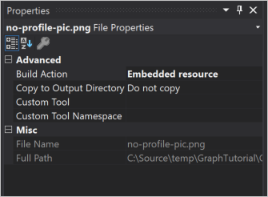

<!-- markdownlint-disable MD002 MD041 -->

1. Откройте Visual Studio и выберите **создать новый проект**.

1. В диалоговом окне **Создание нового проекта** выберите **мобильные приложения (Xamarin. Forms)**, а затем нажмите кнопку **Далее**.

    

1. В диалоговом окне **Настройка нового проекта** введите `GraphTutorial` **имя проекта** и **имя решения**, а затем нажмите кнопку **создать**.

    > [!IMPORTANT]
    > Убедитесь, что вы вводите точно такое же имя для проекта Visual Studio, которое указано в этих инструкциях лаборатории. Имя проекта Visual Studio становится частью пространства имен в коде. Код в этих инструкциях зависит от пространства имен, которое соответствует имени проекта Visual Studio, указанного в данных инструкциях. Если вы используете другое имя проекта, код не будет компилироваться, если не настроить все пространства имен в качестве имени проекта Visual Studio, вводимого при создании проекта.

    

1. В диалоговом окне **Создание многоплатформенного приложения** выберите **пустой** шаблон и выберите платформы, которые необходимо создать на **платформе**. Нажмите кнопку **ОК** , чтобы создать решение.

    

## <a name="install-packages"></a>Установка пакетов

Прежде чем переходить, установите некоторые дополнительные пакеты NuGet, которые будут использоваться позже.

- [Microsoft. Identity. Client](https://www.nuget.org/packages/Microsoft.Identity.Client/) для обработки проверки подлинности и управления маркерами Azure AD.
- [Microsoft. Graph](https://www.nuget.org/packages/Microsoft.Graph/) для совершения вызовов в Microsoft Graph.

1. Выберите **инструменты > диспетчер пакетов NuGet > консоли диспетчера пакетов**.

1. В консоли диспетчера пакетов введите указанные ниже команды.

    ```Powershell
    Install-Package Microsoft.Identity.Client -Version 4.10.0 -Project GraphTutorial
    Install-Package Microsoft.Identity.Client -Version 4.10.0 -Project GraphTutorial.Android
    Install-Package Microsoft.Identity.Client -Version 4.10.0 -Project GraphTutorial.iOS
    Install-Package Microsoft.Graph -Version 3.0.1 -Project GraphTutorial
    ```

## <a name="design-the-app"></a>Проектирование приложения

Сначала обновите `App` класс, чтобы добавить переменные для отслеживания состояния проверки подлинности и вошедшего пользователя.

1. В **обозревателе решений**разверните проект **графтуториал** , а затем разверните файл **app. XAML** . Откройте файл **app.XAML.CS** и добавьте приведенные ниже `using` операторы в начало файла.

    ```csharp
    using System.ComponentModel;
    using System.IO;
    using System.Reflection;
    using System.Threading.Tasks;
    ```

1. Добавьте `INotifyPropertyChanged` интерфейс к объявлению класса.

    ```csharp
    public partial class App : Application, INotifyPropertyChanged
    ```

1. Добавьте в `App` класс указанные ниже свойства.

    :::code language="csharp" source="../demo/GraphTutorial/GraphTutorial/App.xaml.cs" id="GlobalPropertiesSnippet":::

1. Добавьте в `App` класс следующие функции. Функции `SignIn`, `SignOut`и, `GetUserInfo` а также — это просто заполнители.

    ```csharp
    public async Task SignIn()
    {
        await GetUserInfo();

        IsSignedIn = true;
    }

    public async Task SignOut()
    {
        UserPhoto = null;
        UserName = string.Empty;
        UserEmail = string.Empty;
        IsSignedIn = false;
    }

    private async Task GetUserInfo()
    {
        UserPhoto = ImageSource.FromStream(() => GetUserPhoto());
        UserName = "Adele Vance";
        UserEmail = "adelev@contoso.com";
    }

    private Stream GetUserPhoto()
    {
        // Return the default photo
        return Assembly.GetExecutingAssembly().GetManifestResourceStream("GraphTutorial.no-profile-pic.png");
    }
    ```

1. `GetUserPhoto` Функция возвращает фотографию, используемую по умолчанию. Вы можете указать собственный файл или скачать его, который использовался в примере, на сайте [GitHub](https://github.com/microsoftgraph/msgraph-training-xamarin/blob/master/tutorial/images/no-profile-pic.png). Если вы используете свой файл, переименуйте его в **но-профиле-пик. png**.

1. Скопируйте файл в каталог **./графтуториал/графтуториал** .

1. Щелкните правой кнопкой мыши файл в **обозревателе решений** и выберите пункт **свойства**. В окне **Свойства** измените значение **действия при построении** на **внедренный ресурс**.

    

### <a name="app-navigation"></a>Навигация в приложении

В этом разделе показано, как изменить основную страницу приложения на [страницу с основными и подробными данными](/xamarin/xamarin-forms/app-fundamentals/navigation/master-detail-page). Откроется меню навигации, чтобы переключиться между представлениями в приложении.

1. Откройте файл **MainPage. XAML** в проекте **графтуториал** и замените его содержимое приведенным ниже кодом.

    :::code language="xaml" source="../demo/GraphTutorial/GraphTutorial/MainPage.xaml":::

#### <a name="implement-the-menu"></a>Реализация меню

1. Щелкните правой кнопкой мыши проект **графтуториал** и выберите команду **Добавить**, а затем — **Новая папка**. Назовите папку `Models`.

1. Щелкните правой кнопкой мыши папку **Models** и выберите команду **Добавить**, а затем — **класс...**. Назовите класс `NavMenuItem` и нажмите кнопку **Добавить**.

1. Откройте файл **NavMenuItem.CS** и замените его содержимое на приведенный ниже код.

    :::code language="csharp" source="../demo/GraphTutorial/GraphTutorial/Models/NavMenuItem.cs" id="NavMenuItemSnippet":::

1. Щелкните правой кнопкой мыши проект **графтуториал** и выберите команду **Добавить**, а затем — **новый элемент...**. Выберите **страницу содержимого** и присвойте странице `MenuPage`имя. Нажмите кнопку **Add** (Добавить).

1. Откройте файл **менупаже. XAML** и замените его содержимое приведенным ниже кодом.

    :::code language="xaml" source="../demo/GraphTutorial/GraphTutorial/MenuPage.xaml":::

1. Разверните **менупаже. XAML** в **обозревателе решений** и откройте файл **MenuPage.XAML.CS** . Замените его содержимое приведенным ниже.

    :::code language="csharp" source="../demo/GraphTutorial/GraphTutorial/MenuPage.xaml.cs" id="MenuPageSnippet":::

    > [!NOTE]
    > Visual Studio сообщит об ошибках в **MenuPage.XAML.CS**. Эти ошибки будут устранены на более позднем этапе.

#### <a name="implement-the-welcome-page"></a>Реализация страницы приветствия

1. Щелкните правой кнопкой мыши проект **графтуториал** и выберите команду **Добавить**, а затем — **новый элемент...**. Выберите **страницу содержимого** и присвойте странице `WelcomePage`имя. Нажмите кнопку **Add** (Добавить). Откройте файл **велкомепаже. XAML** и замените его содержимое приведенным ниже кодом.

    :::code language="xaml" source="../demo/GraphTutorial/GraphTutorial/WelcomePage.xaml":::

1. Разверните **велкомепаже. XAML** в **обозревателе решений** и откройте файл **WelcomePage.XAML.CS** . Добавьте к классу `WelcomePage` следующую функцию:

    :::code language="csharp" source="../demo/GraphTutorial/GraphTutorial/WelcomePage.xaml.cs" id="OnSignInSnippet":::

#### <a name="add-calendar-page"></a>Страница "Добавление календаря"

Теперь добавьте страницу "Календарь". Это будет просто заполнитель.

1. Щелкните правой кнопкой мыши проект **графтуториал** и выберите команду **Добавить**, а затем — **новый элемент...**. Выберите **страницу содержимого** и присвойте странице `CalendarPage`имя. Нажмите кнопку **Add** (Добавить).

#### <a name="update-mainpage-code-behind"></a>Обновление кода MainPage

Теперь, когда все страницы находятся на месте, обновите код программной части для **MainPage. XAML**.

1. Разверните **MainPage. XAML** в **обозревателе решений** и откройте файл **MainPage.XAML.CS** и замените все содержимое приведенным ниже кодом.

    :::code language="csharp" source="../demo/GraphTutorial/GraphTutorial/MainPage.xaml.cs" id="MainPageSnippet":::

1. Сохраните все изменения. Щелкните правой кнопкой мыши проект, который требуется запустить (Android, iOS или UWP), и выберите пункт **Назначить запускаемым проектом**. Нажмите клавишу **F5** или выберите **Отладка > начать отладку** в Visual Studio.

    
